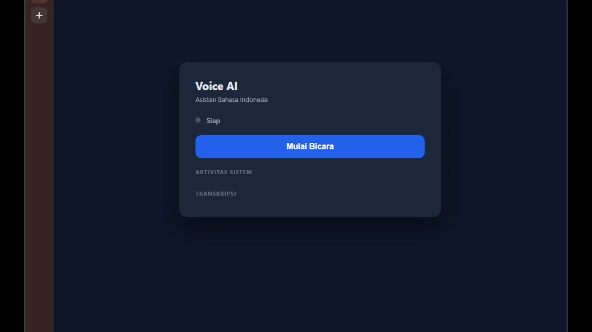

# ASR VoIP POC — Voice AI Bahasa Indonesia

Real-time voice pipeline: **ASR → LLM → TTS** via LiveKit. Model AI berjalan di cloud (Groq, Bifrost, Edge TTS) — tanpa perlu GPU lokal.

## Demo

[](assets-visual/short-demo.mp4)

*Klik gambar untuk mengunduh video demo (2.7 MB MP4)*

## Stack

| Komponen | Backend | Model | Lokasi |
|----------|---------|-------|--------|
| ASR | Groq API | whisper-large-v3 | cloud |
| LLM | Bifrost gateway | llama.cpp/gemma-4-12b-it-q8 | cloud |
| TTS | Microsoft Edge TTS | id-ID-ArdiNeural | cloud |
| Realtime | LiveKit Server (Docker) | Silero VAD | VM |
| Web App | Vanilla HTML/JS + livekit-client v2 | — | VM |

Tidak ada kebutuhan VRAM lokal — semua inference di cloud.

## Quickstart

```bash
# 1. Setup: venv + deps
make setup

# 2. Konfigurasi .env
cp livekit_agent/.env.example livekit_agent/.env
# isi: ASR_API_KEY (Groq), BIFROST_API_KEY, BIFROST_MODEL

# 3. Start LiveKit server (Docker)
docker run -d --name livekit-server --restart unless-stopped \
  -p 7880:7880 -p 7881:7881 -p 7882:7882/udp \
  -v "$(pwd)/livekit_server/livekit.yaml:/etc/livekit.yaml" \
  livekit/livekit-server:latest --config /etc/livekit.yaml

# 4. Start TLS proxy (nginx, HTTPS untuk mic access)
docker run -d --name nginx-proxy --restart unless-stopped \
  -p 8443:8443 --network lk-proxy \
  --add-host host.docker.internal:host-gateway \
  -v "$(pwd)/livekit_server/nginx/nginx.conf:/etc/nginx/nginx.conf:ro" \
  -v "$(pwd)/certs:/etc/nginx/certs:ro" \
  nginx:alpine
docker network connect lk-proxy livekit-server

# 5. Start web + agent
make web
make agent

# 6. Buka browser
# → https://<ip-vm>:8443 (accept self-signed cert)
# → Klik "Mulai Bicara" → Bicara dalam Bahasa Indonesia
```

## HTTPS & Akses

- **Web UI**: `https://<ip-vm>:8443` (via nginx TLS reverse proxy)
- **LiveKit signaling**: `wss://<ip-vm>:8443/rtc` (nginx → LiveKit :7880)
- **Media WebRTC**: langsung ke LiveKit `:7881/:7882` (UDP/TCP)
- **HTTPS wajib** agar browser mengizinkan akses mikrofon (`getUserMedia` butuh secure context)
- **Self-signed cert** (`certs/`, generate via openssl) → browser tampilkan warning, klik "Proceed"
- **Publik?** Tidak. Hanya bisa diakses dari jaringan LAN VM (dan port harus diizinkan firewall). Untuk akses publik perlu domain + Let's Encrypt + firewall terbuka.

## Arsitektur

```
Browser → https://<ip-vm>:8443 (nginx TLS)
            ├── /      → web UI :8080
            ├── /rtc   → wss → LiveKit :7880
            └── media  → LiveKit :7881/:7882 (WebRTC direct)
                              │
                         Voice Agent
                            ├──→ ASR: Groq Whisper (cloud)
                            ├──→ LLM: Bifrost Gemma 4 (cloud)
                            └──→ TTS: Edge TTS (cloud)
```

## Services

| Target | Service | Port |
|--------|---------|------|
| `make web` | Web client (HTTPS via nginx) | 8080/8443 |
| `make agent` | Voice agent (LiveKit Agents) | — |
| LiveKit (Docker) | WebRTC SFU | 7880/7881/7882 |
| nginx (Docker) | TLS reverse proxy | 8443 |
| `make test` | Test suite | — |

`make all`/`make asr`/`make llm`/`make tts` mengacu stack lama (local inference) — tidak dipakai di konfigurasi cloud ini.

## Development

```bash
source .venv/bin/activate
export PYTHONPATH=src
pytest tests/ -v -k "not skip and not gpu"
```

## API (ASR Service)

| Method | Path | Description |
|--------|------|-------------|
| POST | `/v1/asr/stream` | Streaming real-time (SSE) |
| POST | `/v1/asr/transcribe` | Batch file upload |
| GET | `/health` | Health + model status |

Full contract: [docs/openapi.yaml](docs/openapi.yaml) | Architecture: [docs/architecture.md](docs/architecture.md)

## License

Apache 2.0 (model) — service code: see repository license.
